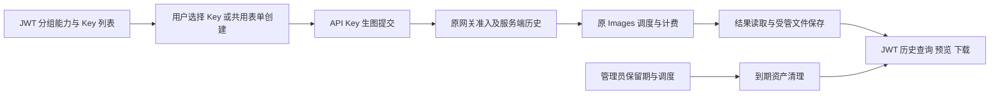

# 普通用户生图控制台技术设计

状态：2026-10-09 最终规划已批准；实施中。需求见 prd.md，证据与开源版本见 research/findings.md。用户已确认图片到期只删除图片文件，所有历史元数据保留；本设计仅实现这一清理行为。

## 1. 架构与边界

采用 Vue 生图工作台、共享 Key 表单、服务端能力发现、经过既有 API Key 网关的控制台异步提交、PostgreSQL 历史与受管图片存储。读取配置和历史使用用户 JWT；生成仍使用用户主动选定的 Key，通过现有 body limit、request ID、API Key、模型白名单及分组准入中间件，然后运行完整 Images handler。不得重新编写上游调用或扣费，也不得由前端提交结果充当权威历史。

新增控制台专用提交入口 `POST /v1/images/generations/studio`，注册在现有 gateway group 及相同准入链中。仅允许已配置、该 Key 所属、用户授权且可生图的分组；提交体不接受 user_id、billing_cost 或存储地址。服务端解析原请求，创建历史并异步执行，返回 202 + history_id。现有公共同步/Redis 异步 API 保持原语义，外部调用不会隐式写入新图库。

从 AsyncImageHandler 提取共享请求验证/审计、上下文复制和 Images 执行机制，允许结果由不同 sink 接收：旧 sink 维持 Redis 与现有 uploader；studio sink 写持久历史和图片。studio 请求不先运行旧 uploader 再复制图片，避免重复存储。新执行上下文明确使用规范路径 `/v1/images/generations`，保留原 Key、user、group、subscription、请求 ID、模型映射、来源 IP 和审计上下文。实施测试路由分类、endpoint 归一化和日志类型，不仅断言 handler 被调用。

已有执行器为进程内任务。初期持久化记录支持刷新和重启后查询；进程中断无法确定上游结果时标记 unknown，不自动重放。有界执行超时、租约和完成写入防止永远停在 processing；此边界不等同于可靠后台队列。

OpenAI/GPT 和 Grok 首期沿用当前网关。能力和协议扩展见第3节；接入新厂商不重复实现页面或计费。

## 2. 管理员配置

新增独立的系统设置项 `image_studio`，通过专用设置接口读写，存入现有 settings 键值存储，不扩充通用 SettingsView 的全部巨大 DTO。

```json
{
  "enabled": true,
  "default_group_id": 11,
  "group_ids": [11, 22],
  "cleanup": {
    "enabled": false,
    "image_retention_days": 30,
    "schedule": "0 3 * * *",
    "timezone": "Asia/Shanghai"
  }
}
```

- 生图开关缺省关闭、无默认分组、空分组列表；清理缺省关闭。任何读取或分组切换都不创建 Key。示例中的保留天数/执行时间是待最终审核的建议初始值。
- 管理员在系统设置的“生图控制台”区块开启功能、选择多个分组，并指定其中一个为默认项。保留配置列表顺序作为界面显示顺序。
- 保存时校验重复/不存在/停用分组、未开启 `allow_image_generation`、未注册或网关未支持的平台，拒绝无效配置。启用时默认分组必须在列表内。
- 首期接受 OpenAI 和 Grok 平台；支持的平台列表由服务端注册表返回，管理页面不维护 GPT-only 列表。
- 不新增另一套价格输入框。收费由所选分组的渠道定价、用户倍率、图片独立倍率及订阅/余额规则决定。
- 删除/停用/改平台等后续分组变更必须在读取时重新验证；配置失效时返回明确不可用原因，不改投未配置分组。
- 普通用户只可发现自己有权限的配置分组。默认分组对该用户不可用时显示原因，可由用户选择其他已配置且授权的模型；不默默切换计费分组。

API：`GET/PUT /api/v1/admin/settings/image-studio`。GET 返回设置、当前可支持的平台标识。PUT 沿用管理员鉴权、管理端标记及审计规则。

## 3. 能力契约与适配器

后端在 `service/image_studio_providers.go` 维护 `ImageStudioProviderRegistry`，以 group.platform 选择适配器，不在 Vue 模板中使用 GPT/Grok 字符串判断。模型公开 ID 是不透明标识，保留现有映射/白名单语义；同名模型处于不同分组时用 `binding_id = group_id + ':' + model_id` 区分。

```go
type ImageStudioProvider interface {
    Platform() string
    DescribeModel(modelID string) (ImageStudioModelSpec, bool)
}

type ImageStudioField struct {
    Key string                       `json:"key"`
    LabelKey string                  `json:"label_key"`
    Kind string                      `json:"kind"` // enum/integer/boolean
    Options []string                 `json:"options,omitempty"`
    Default any                      `json:"default,omitempty"`
    Min *int                         `json:"min,omitempty"`
    Max *int                         `json:"max,omitempty"`
}

type ImageStudioModelSpec struct {
    ModelID string                   `json:"model_id"`
    DisplayName string               `json:"display_name"`
    Platform string                  `json:"platform"`
    Fields []ImageStudioField        `json:"fields"`
    RequestDefaults map[string]any   `json:"request_defaults"`
}
```

服务端 DTO 补充 `binding_id`、`group_id`、分组展示名和第5节 billing_preview；前端为字段类型提供 TypeScript 判别联合及运行时解析，只接收已知字段类型和合法有限数值。未知字段类型提示暂不支持，不伪造参数。后台标签键与中英文词条同步。

模型发现以配置分组、用户授权、已有 `GatewayService.GetAvailableModels`、分组白名单/已有模型发现逻辑、原 Images 模型接受范围与适配器能力取交集。模型目录用于图标/描述补充，不提供授权。保留当前网关白名单显式模型及映射语义，不仅对账号模型枚举结果做字符串前缀过滤。无可调度账号时返回不可用状态；模型枚举不是一次真实生成成功证明。

参数由对应适配器提供：

| 能力 | OpenAI/GPT | Grok |
| --- | --- | --- |
| 模型 | 当前网关接受且分组开放的图片模型 | 当前网关接受且分组开放的 Imagine 图片模型，排除视频/编辑专用项 |
| 尺寸 | 对应型号的 `size`，保守默认 auto 或既有兼容尺寸 | `resolution`：以本项目当前支持的 1k/2k 为准 |
| 宽高比 | 通过合法 size 选项表达 | `aspect_ratio`：复用 Grok geometry 的合法比例 |
| 质量 | 仅型号允许的 `quality` | 仅经网关及型号确认支持的 quality；不沿用 GPT 枚举 |
| 数量 | `n`，按型号和网关最大值约束 | `n`，按对应型号契约约束 |
| 格式/背景/压缩 | 仅支持的型号显示 | 仅支持的型号显示，初期不发送 GPT 专用项 |
| 网关结果 | GPT 原生图片数据返回规则 | 固定 `response_format=b64_json`，官方文档已确认支持 |

型号参数档案使用已有模型常量、能力元数据及实际网关限制；不把外部项目的 4K/分辨率枚举当所有厂商通用选项。未来新的参数通过字段描述加入，既有组件可直接渲染 enum/integer/boolean；新控件类型需扩充描述和渲染器，不变更每个页面。

## 4. 手动 Key 与真实表单复用

`GET /api/v1/user/image-studio/config` 只读，返回当前用户授权的生图分组、默认项、能力、超时和存储可用性。分组 Key 通过既有 keysAPI.list 的 group_id 筛选获取，分页完整处理；选择有效 Key 后才启用生成。仅有停用/过期/耗尽 Key 时说明原因，用户自行管理或创建，系统不自动替换。不能通过前端选项绕过原鉴权的 IP/窗口配额/订阅限制。

把 KeysView.vue 的 Create/Edit BaseDialog、字段状态、平台/分组逻辑、验证和提交提取为 `components/keys/ApiKeyFormDialog.vue`，必要的共用逻辑进入 `composables/useApiKeyForm.ts`。原密钥页和生图页使用同一组件，保留名称、自定义 Key、IP 限制、额度、到期时间、速率窗口等全部字段、现有编辑与引导标识。不要以复制简化表单代替复用。

建议组件契约：show、editingKey、initialGroupId；emits close、created(ApiKey)、updated(ApiKey)。开放创建时先加载授权分组，确定 initialGroupId 的平台再应用分组值，避免原 watcher 把预选值清空；若无权或被停用，给出错误且不选未授权分组。普通密钥页没有 initialGroupId 时保持既有默认选择行为。

创建使用既有 keysAPI.create 与原后端幂等/数量/频率/授权限制。创建成功后刷新其所属分组列表；若仍属于当前选中分组，选中新 Key。表单允许改变分组时，明确展示新 Key 实际归属，不误当当前分组 Key；可由用户切换使用。取消、关闭、读取配置、切换分组、刷新页面均无创建调用。

Key 明文仅为用户自己的网关请求放在内存，不放入 URL、localStorage、历史记录、日志或图片文件；退出登录清空。取消旧 ensure 路由/仓储/事务锁设计，不改 APIKeyRepository 的事务行为。

## 5. 提交、计费关联和执行状态



前端用独立 fetch 与 API Key 调用 studio POST，不让 JWT axios interceptor 覆盖认证。其他控制台接口使用 apiClient。payload 是 model、prompt、适用参数和适配器 defaults；Grok 固定 b64_json，GPT 遵循原返回契约。提交前由服务端再次验证开关、选定组、真实模型能力和参数；请求体与图片数量/大小有上限，检查受管目录可写；失败不得开始计费生成。

前端一次用户提交生成一个 submission_id（UUID，置于专用请求头）；服务端以 `(user_id, submission_id)` 唯一约束原子创建记录并保存规范请求摘要（含 Key/组/模型/参数）。重复相同请求只返回既有记录，不再次执行；同 ID 不同请求返回冲突。该 ID 只是幂等标识，不作为授权凭据；请求 ID 由原服务端中间件生成。可通过 JWT 历史查询 submission_id 找回响应丢失的任务，按钮双击不触发第二个执行。前端不自动重试 POST；用户重试生成需明确新提交，旧结果未知时提示可能已计费。

记录生成状态 `processing/succeeded/failed/unknown`，资产另有 `pending/available/storage_failed/deleting/deleted`。服务端先提交数据库记录再派发一次执行。上游成功后只保存真正解码为合法图片的数据；任一图片失败可标记 storage_failed，并保留其他已存资产。成功生成但图片未保存不是“生成失败/免费”；前端区分两种状态，绝不自动重生图。失败与 panic 写清晰错误分类，避免记录上游敏感正文。重启或执行租约超时后转 unknown；延迟完成需与租约状态条件更新协调，不抢占活跃实例，也不派发未知任务重试。

POST 返回 `{history_id, submission_id, status, poll_url}`，poll_url 指向 JWT 历史详情。页面只轮询当前运行记录，GET 按 Retry-After/退避重试，终态停止，切组或退出页面不改变原记录归属。历史为恢复依据，浏览器最多缓存无凭据记录 ID。

- 图片按张/token、分组/用户倍率及余额/订阅全由原 gateway 处理；录入历史、存储、轮询和下载不调用扣费。
- 原 billing 接口仅 token scope。config 的 billing_preview 复用既有渠道定价、用户/分组与独立图片倍率解析，返回 mode、image_rate_independent、resolved_image_multiplier、effective_token_multiplier、observed_at。token 用量未知或多渠道价不同不报确定总价；实际费用以使用记录为准。
- 关联原 middleware client_request_id；当前 `resolveUsageBillingRequestID` 的 Images 规则为 `client:<id>`（`gateway_usage_billing.go:217`）。保存 correlation_id 与对应 usage_request_id，不把上游 ResponseID/浏览器幂等 ID 当计费 ID。按 user_id + api_key_id + request_id 查询原日志；日志异步落库时显示待结算，找不到不显示 0。不修改原去重或计费事务。
- 历史费用可缓存从原日志得到的已确认金额/币种/计费方式及时间快照，保留原日志引用；缓存失败重查原日志，历史写入失败不影响已完成扣费，也不对原生成再次扣费。原 usage 清理和图片清理相互独立。

## 6. 持久历史、图片身份与下载

新增内部边关联的 Ent schema 与 SQL 迁移：

| 表 | 核心字段与索引 |
| --- | --- |
| image_studio_generations | id、user_id、api_key_id、group_id、分组/Key 名称快照、platform、model_id、prompt、parameters JSON、submission_id/request_hash、correlation_id/usage_request_id、生成状态/错误分类、租约、created_at/completed_at、已确认费用快照；唯一 user_id+submission_id；user_id+created_at+id；user_id+group_id/status/model_id 索引 |
| image_studio_assets | id、generation_id、index、storage_backend/root_id、storage_key、mime_type、byte_size、checksum、状态、saved_at/deleted_at、失败次数/错误分类、cleanup_lease_until/next_retry_at；generation_id+index 唯一；状态+saved_at/next_retry_at 清理索引 |

不把 API Key 明文、上游凭据、图片 base64 或预签名 URL写入数据库/Redis。用户/Key/分组的删改不级联删除作品；数字归属与显示快照保留。历史只记录新控制台提交，不能从以前的费用日志找回未保存图片。

初期使用 `ImageStudioAssetStore` 的本地适配器，根目录在 Wire 构造时由现有数据目录解析器提供，固定为 `<data_dir>/image-studio`；不暴露任意路径输入给管理员。接口为 Put/Open/Delete，返回稳定 storage key、MIME 和字节数。初期不新增 S3 配置管理；后续 S3 适配器需保存可追溯且可读删的存储绑定，不能只切换当前全局 bucket 就认为旧图片已迁移。

- 存储键由服务端 UUID/记录 ID/图片序号及实际 MIME 扩展名组成；禁止使用用户 prompt/model 作为路径。受管根目录 0700、文件 0600；临时文件同目录原子 rename，防穿越/软链读取和部分文件下载。记录 root_id 用于验证存储部署绑定，换目录需迁移已有文件而非静默失联。
- 资产写入前先登记 pending 资产与确定键，保存成功后改 available，防止上传后数据库失败产生不可追踪孤儿。保存/完成写入重试仅重试本地持久化；失败或中断保留资产登记，由恢复/清理负责，不重新调用上游。
- 从 image_storage.go 提取 ImageResultReader 复用图片解码/URL读取限制，默认每张 32 MiB、60 秒。网络请求来源仅为已认证执行返回的数据，采用项目出站 URL/SSRF 限制，检查 redirects/内容和大小，不做任意 URL 下载代理。PNG/JPEG/WebP 以实际字节确认，拒绝 HTML/非图片。控制整体响应内存上限及输出数量，避免无限 recorder/并发大图内存。
- 部署 Compose 已持久挂载 /app/data；单实例不依赖 S3。多实例必须共享同一受管卷，数据库清理认领不能代替文件共享。上线说明包括备份目录和容量；历史是元数据持久化，是否恢复图片取决于文件备份。

JWT API（本人归属从认证上下文取得，不接受查询 user_id）：

- `GET /api/v1/user/image-studio/config`：能力、分组、默认项和当前保留提示。
- `GET /api/v1/user/image-studio/history`：分页 page/page_size（有上限），created_from/to、group_id、model_id、status、prompt_query、submission_id；按 created_at/id 降序，不只查当前组或当前 Key。时间和长度校验，提示词参数化查询。
- `GET /api/v1/user/image-studio/history/:id`：生成详情、参数、费用状态、资产状态、预览/下载接口引用。
- `GET /api/v1/user/image-studio/history/:id/images/:asset_id/content`：本人记录+所属 available 资产检查后流式读取；inline 默认、download=1 使用 attachment；MIME、Content-Length、安全生成文件名、no-store。

未授权/不存在统一404；已清理410且返回明确原因；存储临时不可读503，不伪报已删除；跨用户不能读图片/提示词/费用。JWT 内容 fetch 转 Blob，下载扩展名按 MIME。原 Key 删除或余额不足不妨碍本人 JWT 历史阅读；关闭生图只停止新提交，仍可访问未清理历史。

## 7. 界面与开源复用

新增 `/image-studio` 用户路由与普通控制台导航项，不使用 Gemini batch 权限开关。页面采用现有 AppLayout、Input/TextArea/Select/Icon、btn/card/theme tokens 与 vue-i18n。布局为分组与 Key 区、模型/参数区、提示词输入区、结果预览区及历史记录区，移动端上下排列。分组旁放“创建 API 密钥”按钮，Key 下拉显示名称/可用状态，缺少可用 Key 时禁用生成并显示创建入口。历史提供分页、日期/分组/模型/状态/关键词筛选、详情及逐张下载；保留状态和生成状态分别显示。列表只加载当前页，图片按需通过 JWT 内容接口加载 Blob，不把 Bearer token 放到图片 URL。卸载/换用户时撤销 object URL 并停止轮询。

参照 Open Generative AI 的模型参数、提示词、生成状态、结果卡片与下载流程；实际移植其 MIT 下载命名/Blob辅助模块，补充 HTTP状态和 MIME校验。改造 Toonflow 的 Vue resolution/ratio设置交互及比例缩略形状，替换 Element Plus 为本项目控件与 Tailwind。维持真实源码复用记录，避免把仅看过项目称为已集成。

新增 `frontend/THIRD_PARTY_NOTICES.md`（已有文件则追加），记载来源文件、固定 commit、版权和完整 MIT 许可。所有新增模块使用本项目构建与依赖，不安装整套 React/Element Plus/无限画布框架。

## 8. 管理员清理与恢复

系统设置 image_studio.cleanup 中独立配置 enabled、image_retention_days（正整数并有合理上限）、schedule（沿用5字段 cron）、timezone（有效 IANA）。保留时长决定什么图片到期，schedule 决定何时执行；不把运行间隔误作图片 TTL。建议默认30天、每日03:00、Asia/Shanghai，开关默认关闭，待最终审核。清理与新生成开关解耦，生成停用后仍可清理已有资产。

实现 ImageStudioCleanupService，参考 OpsCleanup 的 Start/Stop/Reload 和 cron parser；管理员保存后本实例 Reload，其他实例周期性刷新设置版本并每次运行重读启停/保留策略。独立命名的 leader lock + 数据库资产租约认领，锁失败不无锁执行，数据库条件更新是多实例最终保证。定量批次、不长持事务跨文件 IO；每次运行有超时、取消和 heartbeat，提供上次运行时间、成功/失败/删除字节数，不记录凭据或完整提示词。

清理 available 且 generation 终态的资产，截止时间按 saved_at + 当前有效保留天数；每次认领在同一事务检查状态、生成终态及过期条件。保留时长缩短会使旧图片于下次运行到期；设置界面明确显示作用于现有图片，不立即同步批量删除。进行中的 pending 不作为过期成品；只在执行租约过期、确认没有活跃执行且经过恢复宽限后回收登记的残留文件。

步骤：批次条件认领 deleting → 删除该受管键 → 成功或文件不存在时写 deleted_at/deleted → 失败保存 next_retry_at/失败次数，下一周期重试；崩溃过期租约可重认领。所有删除有幂等键，不能先把 metadata 标记成功再删文件。只访问记录对应的受管根/key，不扫描或删除上游 URL、旧公共异步对象、Gemini批量资产、备份或计费日志。先打开文件再流式读取可降低与清理竞争；认领后新读返回处理中/已清理，已开始下载按平台文件语义处理。

清理仅删除图片文件；保留 generation 记录、asset 元数据与 deleted_at/状态，以及原提示词、模型、参数、生成时间和已确认费用/关联。所有图片清理后历史列表和详情继续可查询，结果卡片显示“图片已清理”，停止预览和下载，不提供隐式重新生成。部分图片被清理时逐资产显示状态，仍可下载尚可用图片。不增加定期删除历史记录的逻辑，不因图片到期改变元数据或账务。

配置变更和清理摘要沿用管理端审计机制；实际清理状态从数据库/文件结果计算。关闭自动清理停止后续认领，已完成删除不能通过关闭开关恢复。

## 9. 文件与实施边界

- service/image_studio.go、image_studio_settings.go、image_studio_providers.go：设置、授权、能力和价格展示。
- service/image_studio_history.go、repository/image_studio_repo.go、ent/schema/image_studio_{generation,asset}.go、新迁移（实施时最大前缀之后）：历史、幂等、状态、费用关联和认领。
- service/image_studio_asset_store.go、repository/image_studio_storage_local.go、service/image_result_reader.go：受管读写删、稳定身份与共享读取限制；定向保留 image_storage.go 兼容接口。
- handler/image_task_handler.go 与共享 runner：抽取上下文/执行/sink，旧公共 async 不改变；handler/image_studio_gateway_handler.go：studio API Key 提交；handler/image_studio_handler.go：JWT config/history/detail/content。
- service/image_studio_cleanup.go、handler/admin/image_studio_handler.go：清理与管理员设置；handler、route、Wire 和 cmd/server/wire.go 生命周期注册，更新生成代码。
- frontend/components/keys/ApiKeyFormDialog.vue、必要的 useApiKeyForm.ts、views/user/KeysView.vue：真实共用表单；不修改无关主页文件。
- frontend/types/imageStudio.ts、api/imageStudio.ts、composables/useImageStudio.ts、components/imageStudio/*、views/user/ImageStudioView.vue、components/admin/settings/ImageStudioSettings.vue：动态参数、结果/历史、设置。
- 原 router/sidebar/i18n/settings 入口和第三方 notices；必要的新测试与验证证据。

## 10. 验证、风险与回滚

验收映射：能力/参数 AC1/2/5；真实表单/Key AC6/7；原鉴权/计费及一次执行 AC3/12；历史/资产/清理 AC8/10/11；样式/来源 AC4。数据库集成验证幂等、两个用户隔离、并发租约、删除失败/崩溃回收。mock OpenAI/Grok 走真实路由与完整 handler，不绕过中间件；验证独立图片倍率、token 模式、余额和订阅且 GET 无再次生成/扣费。UI 用真实共用组件验证预选组、取消/创建/编辑；用 PNG/JPEG/WebP 字节验收下载、刷新恢复、已清理展示、明暗/移动宽度。

成本与边界：新增历史数据和文件占用持久磁盘；提示词也成为持久数据；多副本需要共享存储；没有可靠任务队列，因此中断结果可能未知；实际平台能力受管理员账号配置限制。清理是不可恢复删除，默认关闭并展示保留策略。这里是待审核设计，不宣称数据库、浏览器、真实上游或生产扣费已验收。

回滚先关闭生图控制台及清理开关，停止新执行/新认领，保留 Key、账务和新表/文件。已提交执行与下载需有停机宽限；回退代码不对新表做破坏性 down、不删 data/image-studio。旧公共 API 保持可用；只回退本任务可归属改动，保存原首页/规范/测试/镜像包。

## upstream 合并边界
用户要求降低后续 upstream/main 冲突。优先新增命名清晰的模块、专用路由注册 helper、独立设置/导航组件、edge-free feature schemas；现有网关和依赖文件仅新增注册/provider及小范围共享执行入口。必须提取的 Key 表单保留对外语义及测试，避免对 KeysView 做额外重排。Ent/Wire生成内容不可手改或省略，合并后从schema重新生成。迁移使用独立完整文件名；冲突风险与接入点记录在交付说明。
